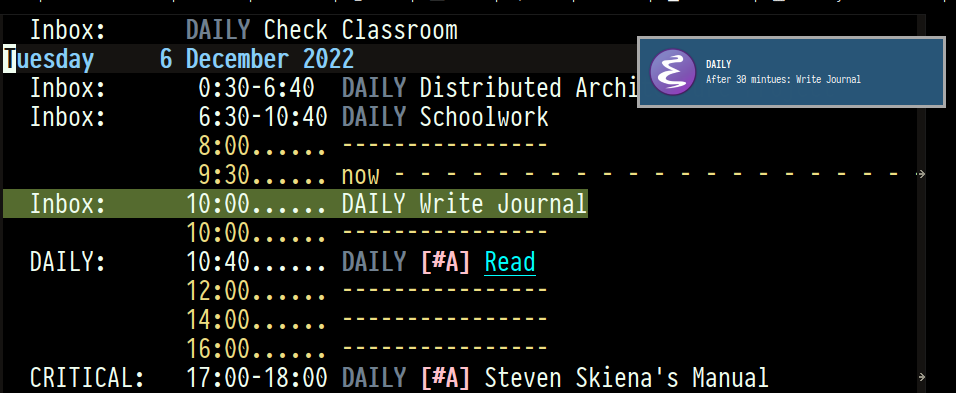
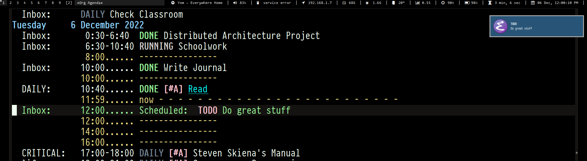

---

agenda-notifier.̶e̶l̶ go is a basic notification daemon for org-mode agenda, a part of the free software text
editor GNU/Emacs.

---

# Features

-   Actually works.
-   Emacs independent, so you will get notified even if Emacs is not running (it
    runs its own process of Emacs).
-   Reminder notification before an event.

# Requirements

-   The `notify-send` command. (preinstalled in most GNU/Linux distributions)
-   It uses `kdialog` in the case of [KDE](https://kde.org/).

# Installation

First [install Go](https://go.dev/doc/install). Then run:

    go install github.com/salehmu/notifier.go/notifier@latest

Now `notifier` should be located at `$GOPATH/bin/` (Probably `$HOME/go/bin`).

# Usage

Auto start the `notifier` command with your system, there are many ways to do so, [this](https://wiki.archlinux.org/title/autostarting) page
could be useful.

## Configuration

The configuration file should be found at `$HOME/.config/agn/config.yaml`, and
it is generated automatically.

    # Whether you are using Emacs or Doom Emacs[fn:3].
    doom: true
    # Emacs ~init.el~ or ~.emacs~ location.
    emacsInitFile: /home/ghd/.doom.d/
    # Scan interval (in seconds) for checking for changes in org-agenda
    scanInt: 300
    # Time (in minutes) before getting a reminder of an event.
    beforeNotification: 30
    # ~doomscript~ binary location, in case of doom.
    doomScriptLoc: /home/ghd/.emacs.d/bin/doomscript

# Why?

Because:

1.  It is hard to maintain (sometimes, impossible<a id="fnr.1" class="footref" href="#fn.1" role="doc-backlink">1</a>, <a id="fnr.2" class="footref" href="#fn.2" role="doc-backlink">2</a>) asynchronous code inside Emacs environment.
2.  Debugging Elisp can be painful, compared to other languages. I tired to use
    [spegoraro/org-alert](https://github.com/spegoraro/org-alert), [doppelc/org-notifications](https://github.com/doppelc/org-notifications), [akhramov/org-wild-notifier.el](https://github.com/akhramov/org-wild-notifier.el) and others
    but I couldn&rsquo;t get persistence with any, and I couldn&rsquo;t also debug to tell what was the
    problem. Actually I told myself then it would be easier to rewrite it rather
    than debugging it, and here we go.

# Screenshots

# Footnotes

<a id="fn.1" href="#fnr.1">1</a> Nothreading. EmacsWiki. Retrieved November 23, 2022, from <https://www.emacswiki.org/emacs/NoThreading>

<a id="fn.2" href="#fnr.2">2</a> Elisp capability of using threads is often described as &rsquo;limited&rsquo;.
